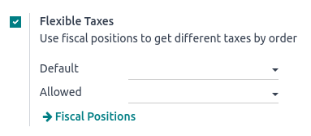
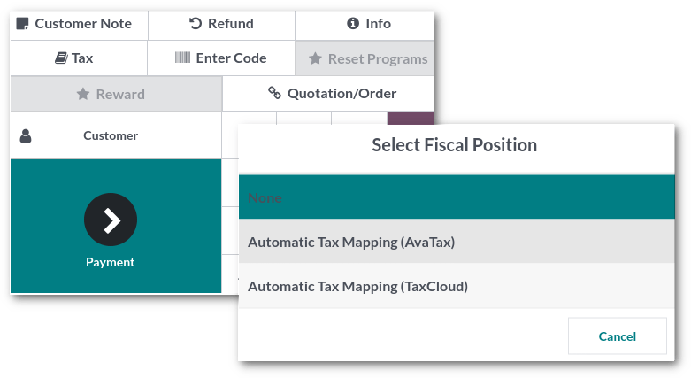

=================================
Flexible taxes (fiscal positions)
=================================

When running a business, you may need to apply different taxes and record transactions on various
accounts based on the location and type of business of your customers and providers.

The **fiscal positions** feature enables you to establish rules that automatically adjust
the taxes and accounts used for each transaction.

.. seealso::
   - :doc:`../../../finance/accounting/taxation/taxes/fiscal_positions`
   - :doc:`../../../finance/accounting/taxation/taxes/taxes`

Configuration
=============

To enable the feature, go to :menuselection:`Point of Sale --> Configuration --> Settings`, scroll
down to the :guilabel:`Accounting` section, and enable :guilabel:`Flexible Taxes`.

Then, set a default fiscal position that should be applied to all sales in POS in the
:guilabel:`Default` field and all the other allowed fiscal positions to choose from in the
:guilabel:`Allowed` field.

According to the fiscal localization package activated, several fiscal positions are preconfigured
and can be set and used in POS. However, to create new ones, :ref:`follow the related documentation
<fiscal_positions/mapping>`.

.. note::
   If you do not set a fiscal position, the products are sold based on the customer taxes assessed
   on the product form.

Use fiscal positions
====================

Open a :ref:`POS session <pos/start-session>` to use one of the allowed fiscal positions. Then,
click the :guilabel:`Tax` button next to the **book-shaped** icon and select from the list of
authorized fiscal positions. Doing so applies the defined rules automatically to all the products
subject to the chosen fiscal position's regulations.

.. note::
   If a default fiscal position is set, the tax button displays the name of the fiscal position.

.. seealso::
   :doc:`../../../finance/accounting/taxation/taxes/fiscal_positions`
