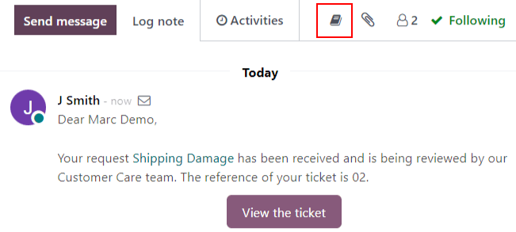
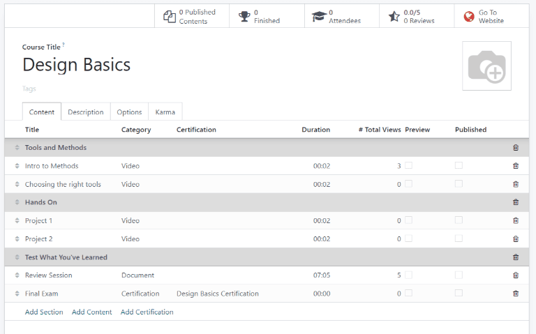

===========
Help Center
===========

Odoo :guilabel:`Helpdesk` integrates with the :guilabel:`Forums, eLearning`, and
:guilabel:`Knowledge` apps to create the :guilabel:`Help Center`. The :guilabel:`Help Center` is a
centralized location where teams and customers can search for and share the information.

.. warning::
   As all of the :guilabel:`Help Center` features require integration with other applications,
   enabling any of them may result in the installation of additional modules or applications.
   *Installing a new application on a One-App-Free database will trigger a 15-day trial. At the end
   of the trial, if a paid subscription has not been added to the database, it will no longer be
   accessible.*

Knowledge
=========

Odoo's :guilabel:`Knowledge` application is a collaborative library where users can store, edit, and
share information. The :guilabel:`Knowledge` app is represented throughout the database by the
*book* icon.

Enable knowledge on a helpdesk team
-----------------------------------

First, go to :menuselection:`Helpdesk --> Configuration --> Teams` and select a team, or create a
:doc:`new one <getting_started>`. On the team's settings page, scroll to :guilabel:`Self-Service`
and enable :guilabel:`Knowledge`. If prompted, manually save and refresh the page to activate the
feature. Once the page has refreshed, a field labeled :guilabel:`Article` will appear.

Odoo automatically creates an article titled `Help` when this feature is activated. Select it from
the drop-down to enable it.

.. tip::
   To create a new article, go to :menuselection:`Dashboard --> Knowledge`. Click the plus sign
   (:guilabel:`+`) next to :guilabel:`Workspace`.

Once an article has been created and assigned to a :guilabel:`Helpdesk team`, content can be
:doc:`added <../../../productivity/knowledge/articles_editing>` and organized through the
:guilabel:`Knowledge` app.

Searching articles from a helpdesk ticket
-----------------------------------------

When members of a :guilabel:`Helpdesk team` are trying to solve a ticket, they can search through
the content in the :guilabel:`Knowledge` app for more information on the issue they are facing.

First, open a :guilabel:`ticket`, either from the :guilabel:`Helpdesk` dashboard or by going to
:menuselection:`Helpdesk --> Tickets --> All Tickets` and selecting a :guilabel:`ticket` from the
list. Click on the :guilabel:`Knowledge` icon above the :guilabel:`chatter` for the
:guilabel:`ticket`. This will open the search window.

.. image:: help_center/help-center-knowledge-search.png
   :align: center
   :alt: View of knowledge search window from a helpdesk ticket.

.. tip::
   :guilabel:`Knowledge` articles can also be searched by clicking `Ctrl + K` to open
   the command pallette, then `?` to narrow the search to :guilabel:`articles`.

Clicking on an article, or highlighting the :guilabel:`article` title and clicking `Enter` will open
the :guilabel:`article` in :guilabel:`Knowledge` app. To open the :guilabel:`article` in a new tab,
click `Ctrl + Enter`.

Sharing articles to the help center
~~~~~~~~~~~~~~~~~~~~~~~~~~~~~~~~~~~

In order for a :guilabel:`Knowledge` article to be available to customers and website visitors,
it has to be published.

.. note::
   Even though the `Help` article has been enabled on a team, it will not share all the nested
   articles to the web. Individual articles that are intended for customers *must* be published
   in order to be viewable on the website.

First, navigate to the :guilabel:`article` to be published by following the steps above. In the
upper right corner of the article, click the :guilabel:`Share` button, and slide the toggle button
labeled :guilabel:`Share to Web` to read :guilabel:`Article Published`.

.. image:: help_center/help-center-knowledge-sharing.png
   :align: center
   :alt: View of a knowledge article focused on sharing and publishing options.

Save time solving tickets with templates
----------------------------------------

:guilabel:`Template` boxes can be added to :guilabel:`Knowledge` articles, and then sent as messages
or added to the description on a :guilabel:`ticket`.

Adding templates to articles
~~~~~~~~~~~~~~~~~~~~~~~~~~~~

To create a :guilabel:`template`, go to the `Help` article (:menuselection:`Dashboard --> Knowledge
--> Help`). Click on an existing nested article or create a new one by clicking the plus sign
(:guilabel:`+`) next to `Help`.

Type `/` to view a list of commands. Select or type `template`. A gray template block will be added
to the page. Add any necessary content to this block.

.. image:: help_center/help-center-knowledge-template-options.png
   :align: center
   :alt: View of a template in knowledge with focus on send and copy options.

Using templates in tickets
~~~~~~~~~~~~~~~~~~~~~~~~~~

Templates can be used to respond directly to a :guilabel:`Helpdesk ticket` as a message or to add
information to the ticket's description. First, open a ticket, either from the :guilabel:`Helpdesk`
dashboard or by going to :menuselection:`Helpdesk --> Tickets --> All Tickets` and selecting a
ticket from the list.

Click on the :guilabel:`Knowledge` icon above the :guilabel:`chatter` for the :guilabel:`ticket`.
This will open a search window. Click on or search for the appropriate article. This will open the
:guilabel:`Knowledge` article page.

To use the template to respond to a ticket, click :guilabel:`Send as message` in the upper right
corner of the template. A :guilabel:`Compose email` window will open. Make any necessary additions
or edits to the template, then click :guilabel:`Send`.

To use the template to add information to a description on a ticket, click :guilabel:`Use as
description` in the upper right corner of the template. This will **not** replace the existing text
in a ticket's description, it will only be added as additional text.

Community Forum
===============

A :guilabel:`Community Forum` provides a space for customers to answer each other's questions and
share information. By integrating a forum with a :guilabel:`Helpdesk` team, tickets submitted by
customers can be converted to posts and shared.

Enable forums on a helpdesk team
--------------------------------

First, go to :menuselection:`Helpdesk --> Configuration --> Teams` and select a team, or create a
:doc:`new one <getting_started>`. On the team's settings page, scroll to :guilabel:`Self-Service`,
and enable :guilabel:`Community Forum`. If prompted, manually save and refresh the page to activate
the feature. Once the page has refreshed, a field labeled :guilabel:`Forums` will appear.

Odoo automatically creates a forum titled `Help` when this feature is activated. Select it from the
drop-down to enable it. To create a new forum, or add an additional forum, type the name into the
field, and click :guilabel:`Create and edit`.

Setting up a forum
------------------

The settings on a :guilabel:`Forum` are managed through either the :guilabel:`Website` or
:guilabel:`eLearning` applications. From the Odoo dashboard, navigate to :menuselection:`Website -->
Configuration --> Forums` or :menuselection --> eLearning --> Forum --> Forums`. In either case,
select a forum to edit from the list.

Select a mode. :guilabel:`Questions` mode allows for one answer/response for each post, while
:guilabel:`Discussion` mode allows for multiple responses. To limit the forum to a single website,
select it from the :guilabel:`Website`.

Under the :guilabel:`Order and Visibility` section,choose how the posts should be sorted by updating
the :guilabel:`Default Sort` field. Change the :guilabel:`Privacy` setting to change what users will
have access to the forum.

Below these settings there is space to add a description for the forum. This description will be
visible on the website where the forum is published.

Choosing karma gains and rights
~~~~~~~~~~~~~~~~~~~~~~~~~~~~~~~

When users interact on :guilabel:`Forums`, either through posting questions, answers, or upvoting
responses, they earn points, called *karma*. Karma points are used to build the credibility of a
user within the community. The more positive interactions a user has on the forum, the more karma
points they gain. Certain activities, such as posting without validation and editing posts, require
users to have earned specific levels of karma points.

These numbers can be adjusted on the :guilabel:`Karma gains` and :guilabel:`Karma related rights`
tabs on the :guilabel:`Forums` settings page.

.. tabs::

   .. tab:: Karma gains

      Below are the actions that will cause users to gain or lose karma points.

      - Asking a questions
      - Question upvoted
      - Question downvoted
      - Answer upvoted
      - Answer downvoted
      - Accepting an answer
      - Answer accepted
      - Answer flagged

   .. tab:: Karma related rights

      Below are the activities that users cannot complete without having a specific level of karma
      points.

      - Ask questions
      - Answer questions
      - Upvote
      - Downvote
      - Edit own posts
      - Edit all posts
      - Close own posts
      - Close all posts
      - Delete own posts
      - Delete all posts
      - Nofollow links
      - Accept an answer on own questions
      - Accept an answer to all questions
      - Editor features: image and links
      - Comment own posts
      - Comment all posts
      - Convert own answers to comments and vice versa
      - Convert all answers to comments and vice versa
      - Unlink own comments
      - Unlink all comments
      - Ask questions without validation
      - Flag a post as offensive
      - Moderate posts
      - Change question tags
      - Create new tags

Creating a forum post from a helpdesk ticket
--------------------------------------------

Tickets submitted to a :guilabel:`Helpdesk` team with a :guilabel:`Forum` can be converted to a
forum post.

Select a ticket (either from a team's pipeline or from :menuselection:`Tickets --> All Tickets`).
At the top of the ticket, click the :guilabel:`Share on Forum` button.

.. image:: help_center/help-center-share-on-forum.png
   :align: center
   :alt: Overview of the Forums page of a website to show the available ones in Odoo Helpdesk.

Before posting to the forum, the post and title can be edited to correct any typos, or to remove any
proprietary or client information. Add any :guilabel:`Tags` to help organize the post in the forum
and make it easier for users to search. Then click :guilabel:`Create and View Post`.

eLearning
=========

:guilabel:`eLearning` courses offer customers additional training and content in the form of videos,
presentations, and quizzes. Providing additional training enables customers to work through issues
and find solutions on their own, and develop a deeper understanding of the services and products
they are using.

Enable eLearning courses on a helpdesk team
-------------------------------------------

First, go to :menuselection:`Helpdesk --> Configuration --> Teams` and select a team, or create a
:doc:`new one <getting_started>`. On the team's settings page, scroll to :guilabel:`Self-Service`,
and enable :guilabel:`eLearning`. If prompted, manually save and refresh the page to activate
the feature. Once the page has refreshed, a field labeled :guilabel:`Courses` will appear.

Select an existing course from the drop-down, or type a title in the field and click
:guilabel:`Create and edit` to create a new one. Multiple courses can be assigned to a single team.

Creating an eLearning course
----------------------------

A new :guilabel:`eLearning` course can be created from the :guilabel:`Helpdesk` team's settings page
(as in the step above) or from the :guilabel:`eLearning` app. Go to :menuselection:`Dashboard -->
eLearning --> New`. Add a :guilabel:`course title` and :guilabel:`tags`.

Click on the :guilabel:`Options` tab. Under :guilabel:`Access Rights`, choose the :guilabel:`Enroll
Policy`. This determines what users will be allowed to take the course. Under :guilabel:`Display`,
choose the course :guilabel:`Type` and :guilabel:`Visibility`. The :guilabel:`Visibility` setting
determines whether the course will be available to public site visitors or members.

Adding content to an eLearning course
~~~~~~~~~~~~~~~~~~~~~~~~~~~~~~~~~~~~~

To add content to a course, click the :guilabel:`Content` tab and select :guilabel:`Add Content`.
Choose the :guilabel:`Content Type` from the drop-down and upload the file (or past the link) where
instructed. Click :guilabel:`Save` when finished. Click :guilabel:`Add Section` to organize the
course in sections.

.. note::
   Before adding a certification to a course, go to :menuselection:`eLearning --> Configuration -->
   Settings` and check the box labeled :guilabel:`Certifications`.

Publishing an eLearning course
------------------------------

To allow customers to enroll in a course, both the course and the contents need to be published.

.. note::
   If the :guilabel:`course` is published, but the contents are not, customers will be able to
   enroll in the course, but will not be able to view any of the material. It may be beneficial to
   publish the :guilabel:`course` first if the contents will be released over time (such as classes
   with a weekly schedule). To make the entire course available at once, each piece of content
   should be published first, then the :guilabel:`course` can be published.

To publish a course
~~~~~~~~~~~~~~~~~~~

Navigate to a course's web page (:menuselection:`Dashboard --> eLearning --> Select a Course --> Go
to Website Smart Button` or :menuselection:`Dashboard --> eLearning --> View Course`). At the top of
the page, move the :guilabel:`Unpublished` toggle switch to :guilabel:`Published`.

To publish contents from the back-end
~~~~~~~~~~~~~~~~~~~~~~~~~~~~~~~~~~~~~

Go to a course's content page (:menuselection:`Dashboard --> eLearning --> Select a Course`), and
click the :guilabel:`Published Contents` smart button.

Remove the :guilabel:`Published` filter from the search bar, and switch to :guilabel:`List View` by
clicking on the icon in the upper right corner of the page. Use the checkbox in the left column to
select all of the contents to be published.

Check one of the boxes in the :guilabel:`Is Published` column. A message will appear, confirming all
of the records will be published. Click :guilabel:`Ok`.

.. image:: help_center/help-center-elearning-publish-back-end.png
   :align: center
   :alt: View of a course contents being published in Odoo Helpdesk back-end.

To publish contents from the front-end
~~~~~~~~~~~~~~~~~~~~~~~~~~~~~~~~~~~~~~

Navigate to a course's web page (:menuselection:`Dashboard --> eLearning --> Select a Course --> Go
to Website Smart Button` or :menuselection:`Dashboard --> eLearning --> View Course`). Click on a
piece of content from the list that is labeled :guilabel:`Unpublished` to open it.

At the top of the page, move the :guilabel:`Unpublished` toggle switch to :guilabel:`Published`.

